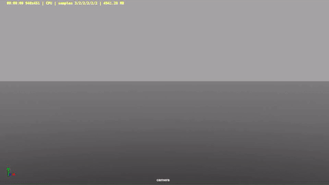

# EVE – Asset & FX Snapshot

Maya + Houdini + Arnold academic mini showcase (props, cloth sim, explosion FX).  
Light repo: clean scene assets + compressed explosion turntable + contribution PDF.

## 🔥 Explosion (MP4 + GIF Fallback)

<video src="assets/explosion_turntable_v01_comp.mp4"
       width="400"
       autoplay
       loop
       muted
       playsinline
       controls>
</video>

## 📁 Files
| Path | Brief |
|------|-------|
| `assets/eve_assets_cellphone.ma` | Smartphone prop |
| `assets/eve_curtain_asset_v01.ma` | Curtain (nCloth ready) |
| `assets/eve_model_female.mb` | Unused base character |
| `assets/explosion_turntable_v01_comp.mp4` | Compressed FX (Houdini → VDB → Arnold) |
| `docs/eve_group_project_brief_flora.pdf` | Contribution / role PDF |

## 📄 Contribution PDF
[Download / View PDF](docs/eve_group_project_brief_flora.pdf)

## 🧩 My Role (6-person team)
3D Modelling • nCloth setup • Houdini Pyro & dust → VDB → Arnold integration.

## 🛠 Pipeline (1‑line)
Maya (models / cloth) → Houdini (pyro + dust) → VDB → Arnold (volume shading) → ffmpeg compress.

## 🗺 Next
Handgun model · Dust VDB (Release) · Topology / wireframe sheet.

**Author:** Xiaohelaiti Feiluore (Flora) — GitHub: [Flora9822](https://github.com/Flora9822)
